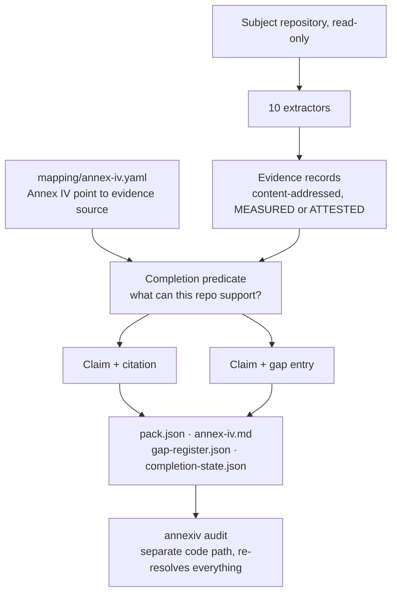

# annexiv

**Generates EU AI Act Annex IV technical documentation from a repository, in
which every claim either cites evidence that resolves or appears in the gap
register, and there is no third option.**

## The problem

Annex IV of Regulation (EU) 2024/1689 lists nine points of technical
documentation a high-risk AI system must carry: the general description, the
development process, monitoring and control, the appropriateness of the
performance metrics, the risk management system, lifecycle changes, applied
harmonised standards, the EU declaration of conformity, and the post-market
performance evaluation system. Most of the facts those points ask for already
exist in the repository, in dependency manifests, dataset manifests, eval
reports, model hashes and git history.

The document, though, gets written by hand in Word, at a distance from the
code. A blank template rewards fluent prose. A validation section reads equally
finished whether or not a validation report exists, and nothing in the format
distinguishes a measured number from a well-phrased sentence. The gap surfaces
when a notified body, a customer or an auditor asks what stands behind a
sentence, which is the most expensive possible moment to find out.

The obvious fix, a better template with more prompts, does not work, because
the failure is not that people forget sections. It is that a template has no
representation for "we asserted this and nothing supports it". A review
checklist does not help either: it is applied by the same people who wrote the
prose, at the same distance from the code.

### And the deadline moved

Material written about Annex IV in 2025 says the obligation lands on
2 August 2026. As at 4 August 2026 that is **no longer correct**. Regulation
(EU) 2026/1744, the Digital Omnibus on AI, published 24 July 2026 and in force
27 July 2026, rewrote Article 113 and deferred Chapter III Sections 1 to 3,
which contain Article 11 and therefore the whole Annex IV duty.

| Classification route | Annex IV applies from |
|---|---|
| Annex III / Article 6(2), standalone high-risk use case | **2 December 2027** |
| Annex I / Article 6(1), the MDR/IVDR product route | **2 August 2028** |

This is encoded as data, not prose: `mapping/annex-iv.yaml` carries
`applicability.in_force_now: false` with the amended Article 113 citation, and
an `applies_from` per route, so the tool prints the date that follows from the
provider's declared route instead of a slogan. The spine was verified against
the Official Journal and the consolidated text 02024R1689-20260727 on
2026-08-04, and records that Annex IV itself has never been amended.

The route is also not obvious. **Annex III contains no entry for medical
diagnosis, clinical decision support or treatment recommendation.** Those reach
high-risk only through Article 6(1), which requires the system to be, or be a
safety component of, a product covered by Annex I harmonisation legislation
*and* to need third-party conformity assessment, so an MDR Class I
self-certified device does not qualify by that route. Annex III touches
healthcare at three points only: 5(a) benefits eligibility, 5(c) health
insurance pricing, 5(d) emergency triage. This tool never decides a route; it
takes the provider's declared classification as an input.

The deferral is not bad news for readiness work. It is runway to build the
evidence trail before anyone asks for it, which is cheaper than assembling it
under audit.

## What this is, and what it is not

**Ships**

| Item | Why |
|---|---|
| `generate`, `audit`, `gaps` over any repository, read-only | The subject is a client repository under engagement; the tool must be incapable of changing what it documents |
| The published mapping spec, `mapping/annex-iv.yaml` and `mapping/MAPPING.md` | The spine, with every requirement verbatim from the Official Journal and its provenance recorded |
| Ten extractors producing content-addressed evidence records | Facts in a repository are checkable; prose about them is not |
| A claim type with no constructor for an unsupported assertion | The invariant is structural rather than a policy someone must remember |
| An auditor that is a separate code path from the generator | The thing that produces must not be the thing that approves |
| A vendored, fully synthetic demo subject with its own test suite | The exhibit has to be honest end to end |

**Does not ship**

| Fence | Why |
|---|---|
| No legal advice, no classification determination, no conformity assessment | Not qualified for it, and claiming it destroys the positioning. Classification is the client's input, recorded as attested |
| No EU declaration of conformity, ever | Article 47 makes it a legal act the provider executes. It is a permanent gap in every pack, and the spec loader rejects any attempt to attach evidence sources to that section |
| No writes to the subject repository | Read-only is a product property; nothing in `repo.py` opens a file for writing |
| No PDF rendering | The plan left the renderer choice open and neither candidate was available on the build host. Recorded as unfinished |
| No invention of structure the regulation lacks | Points 3, 7 and 9 are unlettered blocks; where this tool decomposes them, the pack says the decomposition is ours |

The positioning is verifier, not implementer: this documents and audits a
repository's evidence, it does not build the evidence or the system.

## Measured results

Subject: `examples/toy-deterioration-model`, vendored into this repository,
route `annex_i`, generated 2026-08-04. Figures from
`exhibits/toy-model/completion-state.json` unless noted.

| Metric | Target | Measured |
|---|---|---|
| Section coverage | 9/9 | **9/9** |
| Claims carrying resolvable evidence | at least 70% | **79.3%** (23 of 29) |
| MEASURED share of citations | at least 33.3% | **63.8%** (30 measured, 17 attested, 47 total) |
| Silent assertions | 0 | **0**, confirmed by the independent audit |
| Citations resolving to a file whose hash still matches | 100% | **47/47** |
| Gaps named | at least 3 | **6**, of which 1 is permanent by design |
| Determinism | byte-identical | **byte-identical** pack, Markdown, gap register and completion state |
| Auditor mutation adequacy | not set | **22/22** killed, 0 survived (`tests/mutation/results.json`) |

Determinism is not asserted here, it is re-checked: regenerating the pack into
a scratch directory reproduced all four committed files in
`exhibits/toy-model/` with identical sha256.

The gap register is the part worth reading, because these are the sentences the
pack refuses to write (`exhibits/toy-model/gap-register.json`):

| Annex IV | Kind | Why |
|---|---|---|
| 1(f) | absent | No evidence source covers photographs or illustrations of the product's external features |
| 2(f) | absent | No signed document describes pre-determined changes |
| 3, subgroup accuracy | absent | The evaluation report has no per-subgroup breakdown. The file is present; this part of it is not |
| 8 | **permanent, by design** | The EU declaration of conformity is the provider's legal act under Article 47 |
| 9, evaluation system | absent | No post-market performance evaluation described |
| 9, monitoring plan | absent | No Article 72(3) monitoring plan as its own artefact |

**The empty-repo control.** Pointed at a bare directory, the tool produces
`exhibits/empty-repo/`: 9/9 sections addressed, 29 claims, 0 evidence-backed,
29 gaps, and `annexiv audit` still exits 0, because a pack of pure gaps is a
valid pack. A template given nothing still produces a document that looks
finished. This produces a document that says so.

**The demo subject's own numbers,** from
`examples/toy-deterioration-model/eval/report.json`, on a held-out test split
of 805 encounters at 13.8% positive:

| Metric | Value | 95% CI (Wilson) | n |
|---|---|---|---|
| AUROC | 0.797 | not computed | 805 |
| Sensitivity | 0.784 | 0.698-0.850 | 111 |
| Specificity | 0.650 | 0.614-0.684 | 694 |
| PPV | 0.264 | 0.219-0.314 | 330 |
| NPV | 0.949 | 0.926-0.966 | 475 |

The model is deliberately mediocre and reported unflatteringly. Its operating
threshold (0.417586) was chosen on the validation split only. `sex` is recorded
in the data and deliberately not a model feature, which makes the missing
subgroup breakdown visibly a choice rather than a data limitation.

## Quickstart

Python 3.10.

```
pip install -r requirements.txt
set PYTHONPATH=src

python -m annexiv generate examples/toy-deterioration-model --route annex_i --out ./pack
python -m annexiv audit ./pack/pack.json --repo examples/toy-deterioration-model
python -m annexiv gaps examples/toy-deterioration-model --route annex_i
```

Each runs in about a second, offline. Expected output:

```
annexiv 0.1.0 · toy-deterioration-model @ no-commit            [generate, exit 0]
sections addressed: 9/9 · claims: 29 (23 evidence-backed, 6 gaps)
evidence-backed ratio: 79.3% · MEASURED share: 63.8% · gaps: 6 (1 permanent)

annexiv audit · 29 claims, 47 citations, 6 gaps checked · 0 failure(s)
AUDIT PASSED · every claim resolves to evidence or a gap, every        [exit 0]
citation resolves to a file whose hash still matches

6 gap(s) in toy-deterioration-model: Annex IV 1(f) · absent ...   [gaps, exit 1]
```

`gaps` exiting 1 is the readiness scan reporting that gaps remain, which is
what CI should gate on.

## Command reference

| Command | Does | Flags |
|---|---|---|
| `generate REPO` | Walks the repository, builds evidence records, evaluates the completion predicate, writes `pack.json`, `annex-iv.md`, `gap-register.json`, `completion-state.json` | `--out DIR`, `--spec PATH`, `--route annex_i\|annex_iii` |
| `audit PACK --repo REPO` | Re-walks the finished pack from disk as an untrusted document and re-derives six checks from the repository | `--repo REPO` (required) |
| `gaps REPO` | The gap register alone, the readiness scan, no pack written | `--spec PATH`, `--route annex_i\|annex_iii` |

`--route` is the provider's **declared** classification. The tool never
determines it, and the route only decides which applicability date the pack
prints.

| Command | 0 | 1 | 2 |
|---|---|---|---|
| `generate` | pack written | not used | the run could not proceed |
| `audit` | every check passed | the pack failed a check | the run could not proceed |
| `gaps` | no gaps | gaps remain | the run could not proceed |

`audit` exiting 1 is a working tool reporting a true finding, not an error; the
distinction between 1 and 2 lets CI gate on the finding while still alerting on
a broken run. The six audit checks: every claim carries exactly one of evidence
or a gap, re-checked on raw JSON because a hand-edited pack bypasses the type
system; every evidence id a claim cites exists; every evidence source file still
exists; every recorded sha256 still matches the file on disk; every gap id a
claim cites exists; and the pack's own completion counts match a recount of its
contents.

## How it works



**Design decisions**

1. **A claim carries either a resolvable evidence reference or a gap
   reference, never neither and never both, enforced by the type.** `Claim` is
   a frozen pydantic model whose `_exactly_one_support` validator runs on every
   construction path, including the two classmethod constructors `supported()`
   and `gap()`. There is no third constructor, so "the renderer wrote a sentence
   nothing supports" is not a bug that can occur; it is a state that cannot be
   represented. Citing both raises too: ambiguity there is how a gap gets buried
   under a citation.
2. **Three evidence classes, and only three.** MEASURED is produced by running
   something (a hash, a test report, a dependency tree, a git history) and is
   reproducible from the repository. ATTESTED is prose a **named** human signed,
   with role and date. MISSING becomes a gap entry with a reason. Anonymous
   prose is not weak evidence, it is no evidence: a document with empty
   front-matter yields no record, enforced in `EvidenceRecord.attested` rather
   than left to each extractor's conscience.
3. **Capability keys, so a present file cannot satisfy a requirement it does
   not cover.** An eval report whose `subgroup_breakdown` is null provides
   `eval.overall_accuracy` and not `eval.subgroup_accuracy`, so Annex IV point
   3's subgroup obligation gaps while the file sits right there. That is the
   exact failure mode this tool sells against.
4. **The auditor imports neither the predicate, the extractors nor the
   renderer.** It reads the serialised pack from disk as an untrusted document.
   If it reused the generator's in-memory objects it would confirm the
   generator's opinion of itself; reading the file means a hand-edited claim, a
   stale hash or a deleted evidence file is caught by machinery that never saw
   the run that wrote them.
5. **Git history has two sources, and the fallback is the better-evidenced
   one.** A live `.git` is a directory, so it has no content address; records
   drawn from it carry the HEAD sha and the auditor has to skip re-resolving
   them, which makes git-derived claims the least verifiable in a pack built
   from a checkout. A history bundle (`git bundle create`) is a single file: it
   hashes, the auditor re-resolves it like any other evidence, and tampering
   fails the pack. So the extractor prefers a live repository, falls back to a
   bundle, and records which one each record came from. This also matches the
   engagement shape, where repositories arrive as exports without `.git`.
6. **The spec is data, and a malformed spec is a refusal.** Article 11(3) lets
   the Commission amend Annex IV by delegated act, so the section list, the
   verbatim text, the article cross-references and the applicability dates live
   in YAML and are validated on load. A silently half-loaded spine would
   produce a pack that looks complete while checking less than it says.
7. **Structure is measured, content is attested, and the split is explicit.**
   No tool can judge whether a risk analysis is adequate. It can check that the
   log has the shape a risk management system produces: every risk owned, with
   a status, a mitigation and a review date. A log missing owners is not a
   weaker log, it is `structurally_invalid`, and the section gaps.
8. **Client code is parsed, never imported.** The input-schema extractor reads
   a typed model with `ast`, because importing a stranger's module to document
   it would execute their code.

**Corrections the verification produced,** all encoded in the spec and pinned
by tests: Annex IV has nine top-level points and only 1 and 2 carry lettered
sub-points, (a) to (h) each; points 3, 7 and 9 are unlettered blocks, so their
limbs are flagged `limbs_are_our_decomposition: true`; Articles 10 and 15 are
cited nowhere in Annex IV despite the common assumption, and the tool does not
synthesise anchors the annex lacks; the SME simplified form is Article 11(1)
second subparagraph, not Article 11(2); and point 1 duplicates "a basic
description of the user-interface provided to the deployer" across 1(g) and
1(h) in the published text, rendered as published rather than deduplicated.

## Data

Synthetic only, at every stage: development, tests, calibration, exhibits and
the demo subject. No real patient data was used at any point, and
`examples/toy-deterioration-model/tests/test_repo.py` asserts it.

The demo subject is a real, runnable repository rather than a prop: the data
generator generates, the training script trains, and every number in
`eval/report.json` came from a real run on a held-out split. Its data manifest
pins `seed: 20260804` and the generator's own sha256 (`a56d87988b52ea18…`),
and records 2,409 train, 802 validation and 805 test encounters, 4,016 in
total, after excluding 384 encounters with under six hours of observation.
Cleaning is recorded as method plus counts: 153 implausible cells rejected
against fixed clinical bounds declared in `config/training.yaml`, 188 already
blank, 341 imputed in total from train-split medians applied unchanged to the
other splits. It carries its own 37-test suite. Because it is vendored as plain
files it has no live `.git`; its history travels as `git-history.bundle`.

Two things are missing from it **on purpose**, so the pack has real gaps rather
than manufactured ones: there is no subgroup accuracy breakdown, and there is
no post-market monitoring plan or telemetry configuration. Both are documented
in the subject's `docs/KNOWN-GAPS.md`, and its own tests assert they stay
absent, so nobody quietly fills them in and flattens the exhibit.

## The demo

There is no `examples/demo/index.html` in this repository and no mirrored demo
under `upwork/projects/02-annex-iv-generator/`. The demo is the exhibit pair
under `exhibits/`, reproducible in three commands.

`exhibits/toy-model/` is the pack generated from the demo subject: `annex-iv.md`
is the readable document, carrying the applicability date for the declared
route; `pack.json` is the machine-readable pack (9 sections, 29 claims, 24
evidence records, 6 gaps); `gap-register.json` is the six gaps with their
reasons and the engineering action that would close each; and
`completion-state.json` is the counts the auditor recounts.
`exhibits/empty-repo/` is the same four files generated from a bare directory:
the same 9 sections, 29 claims, 29 gaps, zero prose, and an audit that still
passes. Read the two `annex-iv.md` files side by side; the contrast is the
pitch.

To reproduce both and check them against the committed bytes:

```
set PYTHONPATH=src
python -m annexiv generate examples/toy-deterioration-model --route annex_i --out ./out/check
python -m annexiv audit ./out/check/pack.json --repo examples/toy-deterioration-model
mkdir empty && python -m annexiv generate ./empty --out ./out/empty
```

`out/check/` reproduces `exhibits/toy-model/` byte for byte, verified for all
four files.

## What the build found in itself

**Every attested document matched every requirement of its section, and the
MEASURED share was spurious.** The `attested_docs` source was accepted for all
requirements of any section it fed, so Annex IV 1(a), "intended purpose and
provider name", cited the cybersecurity document and the standards document.
The pack looked richly cited: 150 citations. It was found by reading the
citation list on the generated pack rather than by a failing test, which is why
it counts as a measurement finding rather than a caught bug. Gating attested
sources by document type took citations from 150 to 47 and raised the MEASURED
share from 20.0% to 63.8%. The earlier figure was not a better result; it was
spurious attested citations crowding out machine-derived ones (`PROJECT.md`).

**Vendoring the demo subject silently weakened the pack, and fixing it made
the pack stronger than before.** Removing `.git` cost three git-derived
citations (`PROJECT.md` records the resulting MEASURED share as 58.5%). The
available options were to accept the loss or to vendor a `.git` directory into
the repository, and neither is what a client engagement looks like, so the
extractor gained a bundle fallback instead. The result is better than the
original: a bundle is a file, so it hashes and the auditor re-resolves it,
whereas the live-`.git` records it replaced were the ones the auditor had to
skip. Verified by corrupting one byte of `git-history.bundle`, which turns the
audit red on all six affected citations.

## Verified

- 9/9 sections addressed on both the demo subject and a bare directory, 29
  claims in each, zero silent assertions, and 47 of 47 citations resolving to a
  file whose recorded sha256 still matches. Confirmed on a fresh run made while
  writing this document, by an auditor that shares no code with the generator.
- Byte-identical regeneration: all four files of `exhibits/toy-model/`
  reproduced with identical sha256 from a clean run into a scratch directory.
- Auditor mutation adequacy 22/22, covering both invariant checks, all eleven
  `fail` severities, the missing-file and hash checks, the dangling citation
  and gap checks, the empty-section check, the count recount, and three ways of
  making the auditor structurally blind.
- Tamper detection on the history bundle: one corrupted byte turns six
  citations red (`PROJECT.md`).
- 70 tests pass in 2.0 s; the demo subject's own 37 pass in 2.6 s.
- The regulation reading itself: verified 2026-08-04 against the Official
  Journal text of Regulation (EU) 2024/1689, the consolidated version
  02024R1689-20260727, the omnibus Regulation (EU) 2026/1744, and one
  independent cross-check, with the URLs recorded at the head of
  `mapping/annex-iv.yaml`.

## Not verified

- **No legal review.** The mapping, the route logic and the date table were
  read from primary sources by an engineer. They have not been reviewed by a
  qualified lawyer. The pack is documentation support and engineering evidence:
  not legal advice, not a conformity assessment, and not something that makes
  any system compliant.
- **PDF rendering is not implemented.** Markdown is the source of truth by
  design; the PDF was a day-6 decision and neither weasyprint nor pandoc was
  available on the build host. Closing this needs a renderer on the host and a
  test that the rendered PDF carries the same claim and gap counts.
- **Article 11(2) merged packs are not implemented.** For an Annex I product
  the regulation wants a single documentation set merging Annex IV content into
  the device documentation; this tool emits a standalone pack and states which
  route it was told to assume. Relatedly, the Commission's simplified form for
  SMEs is recorded in the spec as `unverified: the form may not exist yet`, and
  nothing here emits it.
- **The measured ratios are properties of this demo subject**, not of any other
  repository. A repository with less evidence produces a longer gap register,
  which is the tool working rather than failing.
- **One anomaly is reported, not resolved.** Chapter III Section 5 (Articles 40
  to 49, including the Article 47 declaration of conformity) and Chapter IX
  (Article 72 post-market monitoring) apply from 2026-08-02 while the Section 2
  requirements they certify are deferred. The spec flags this and calls it a
  question for qualified legal advice rather than a conclusion of this tool.
- **The RMAD completion predicate is not satisfied**, R = 58. See below.

## Development

```
pip install -r requirements.txt
python -m pytest -q -p no:warnings          # 70 passed in 2.0 s
```

`pytest.ini` sets `pythonpath = src tests`. The 70 split as 22 invariant tests
(`tests/test_invariant.py`, also the mutation oracle, including twelve planted
defects the auditor must catch: a silent assertion, a claim citing both evidence
and a gap, a dangling citation, a deleted evidence file, a tampered file, a
broken hash, a dangling gap reference, a deleted gap register, inflated counts,
an emptied section, a sectionless pack and an unparseable pack), 19 spec tests
pinning the verified regulation structure, 19 extractor tests, 10 end-to-end.

```
src/annexiv/
  cli.py          generate / audit / gaps, exit codes
  spec.py         mapping loader, validates on load or refuses
  repo.py         read-only repository access
  model.py        EvidenceRecord, GapEntry, Claim and its invariant
  predicate.py    what can this repository support?
  render.py       the Markdown pack
  audit.py        the independent re-walk (the mutation target)
  extractors/     attested, changelog, custody, dataset, evalreport,
                  gitlog, inputschema, manifests, risklog, telemetry
mapping/          annex-iv.yaml (the spine), MAPPING.md (published form)
examples/         toy-deterioration-model (the demo subject)
exhibits/         toy-model/ and empty-repo/ packs
```

Python 3.10 (the build host's interpreter; nothing uses a 3.11+ feature).
Dependencies pinned in `requirements.txt`: pydantic 2.12.5, PyYAML 6.0.1,
Jinja2 3.1.3, GitPython 3.1.57.

**RMAD evidence state** (`PROJECT.md`, task ANNEX-1 at commit d35ab60f):
`NOT DONE (6/6 evaluated), R = 58`. O3, O4, O5 and O6 pass, and `rmad doctor`
reports HEALTHY, 73 passed and 0 failed. The residual is O1 (+30: ten criteria
have no passing test RMAD can join to them, because pytest node-ids and graph
test symbols do not join today, a gap recorded in RMAD's own benchmark. The
count is ten rather than five because a retried criterion batch duplicated each
statement, and the duplicates are left in the evidence store rather than
hand-edited out) and O2 (+28: 66 of 94 blast-radius symbols covered, the same
join gap). O5 was caught by the predicate during the build and fixed by
correcting the declared scope rather than waiving it.

Licence: MIT.
